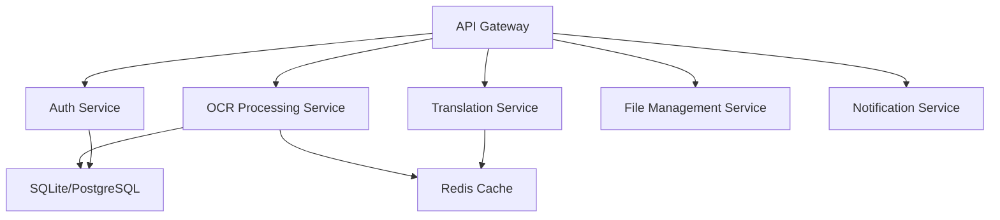

# MonkeyOCR WebApp 代码质量审查与优化建议

## 项目概述

MonkeyOCR WebApp 是一个基于 React + FastAPI 的全栈 OCR 内容提取和可视化应用，具备 Redis 缓存和 LLM 翻译功能。经过全面的代码质量审查，整体架构设计合理，技术栈选择恰当，但仍有许多可以优化的空间。

## 审查维度与评估结果

### 1. 应用架构评估

#### ✅ 优点
- **清晰的分层架构**：前后端分离，职责明确
- **合理的技术栈选择**：React 18 + FastAPI + Redis + SQLite
- **完善的缓存策略**：多层缓存设计（OCR结果缓存、LLM响应缓存）
- **灵活的持久化方案**：Redis + SQLite 双重持久化

#### ⚠️ 需要优化的问题
- **缺少统一的错误处理机制**
- **监控和日志系统不够完善**
- **缺少健康检查和服务发现**
- **API版本控制策略缺失**

### 2. 前端代码质量评估

#### ✅ 优点
- **现代化的React开发模式**：使用函数组件 + Hooks
- **类型安全**：完整的TypeScript支持
- **组件化设计**：shadcn/ui + 自定义组件良好结合
- **状态管理**：Zustand轻量级状态管理，适合项目规模

#### ⚠️ 存在的问题

##### 2.1 组件复用效率问题
- **Hook使用频率过高**：23个文件中发现178处Hook使用，平均每个文件7.7个
- **缺少通用业务Hook**：重复的业务逻辑没有提取为自定义Hook
- **组件粒度不够合理**：部分组件过于复杂（如UploadZone.tsx 345行）

##### 2.2 性能优化问题
- **缺少React.memo优化**：没有对昂贵组件进行记忆化
- **useCallback/useMemo使用不当**：部分地方过度使用，部分地方缺少使用
- **Bundle优化不足**：没有实现代码分割和懒加载

##### 2.3 代码组织问题
- **文件结构深度不一致**：部分功能模块嵌套过深
- **组件职责不够单一**：部分组件承担了过多责任
- **类型定义分散**：没有统一的类型定义策略

### 3. 后端代码质量评估

#### ✅ 优点
- **标准的FastAPI架构**：路由、中间件、依赖注入使用规范
- **完善的数据模型**：Pydantic模型定义完整
- **安全性考虑**：认证、授权、CORS配置合理
- **异步编程**：充分利用了Python异步特性

#### ⚠️ 存在的问题

##### 3.1 代码组织问题
- **服务层逻辑分散**：业务逻辑散落在API路由中
- **工具类职责不清**：utils目录下功能重叠
- **配置管理不统一**：环境变量和配置文件管理混乱

##### 3.2 错误处理问题
- **异常处理不够统一**：缺少全局异常处理器
- **错误信息不够友好**：部分错误信息过于技术化
- **日志记录不够完善**：缺少结构化日志和链路追踪

##### 3.3 性能优化问题
- **数据库查询优化不足**：部分查询可以进一步优化
- **连接池配置不合理**：没有针对生产环境优化
- **缓存策略可以更精细化**

### 4. 数据库模型设计评估

#### ✅ 优点
- **表结构设计合理**：主键、外键、索引设计规范
- **数据完整性保障**：触发器、约束设计完善
- **支持业务扩展**：用户认证、任务共享等功能考虑周全

#### ⚠️ 存在的问题

##### 4.1 性能优化问题
- **索引策略可以优化**：部分查询场景缺少复合索引
- **分页查询优化**：大数据量时的分页性能问题
- **数据归档策略缺失**：历史数据清理机制不完善

##### 4.2 扩展性问题
- **单库设计限制**：无法水平扩展
- **缓存一致性问题**：Redis和SQLite数据同步问题
- **备份恢复策略不完善**

### 5. 缓存策略评估

#### ✅ 优点
- **多层缓存设计**：OCR结果缓存、LLM响应缓存
- **缓存失效策略**：TTL和手动失效机制
- **缓存命中率统计**：通过from_cache字段追踪

#### ⚠️ 可以优化的地方
- **缓存预热机制**：热点数据预加载
- **缓存监控**：缓存命中率、内存使用监控
- **缓存清理策略**：LRU、LFU等智能清理算法

## 详细优化建议

### 1. 架构层面优化

#### 1.1 微服务化改造建议


**实施步骤：**
1. 提取认证服务为独立模块
2. OCR处理服务独立部署
3. 实现服务间通信（gRPC/HTTP）
4. 统一配置中心和服务发现

#### 1.2 监控和可观测性
```yaml
监控组件:
  metrics: Prometheus + Grafana
  logging: ELK Stack (Elasticsearch + Logstash + Kibana)
  tracing: Jaeger
  health: 自定义健康检查端点

关键指标:
  - API响应时间和错误率
  - 缓存命中率
  - 数据库连接池状态
  - 内存和CPU使用率
  - OCR处理队列长度
```

### 2. 前端优化建议

#### 2.1 性能优化方案

**组件优化：**
```typescript
// 1. 使用React.memo优化昂贵组件
const ExpensiveComponent = React.memo(({ data, onUpdate }) => {
  // 组件实现
}, (prevProps, nextProps) => {
  // 自定义比较逻辑
  return prevProps.data.id === nextProps.data.id;
});

// 2. 合理使用useCallback和useMemo
const DocumentViewer = ({ document }) => {
  const processedContent = useMemo(() => {
    return processMarkdown(document.content);
  }, [document.content]);
  
  const handleUpdate = useCallback((newContent) => {
    onDocumentUpdate(document.id, newContent);
  }, [document.id, onDocumentUpdate]);
  
  return <div>{processedContent}</div>;
};

// 3. 虚拟滚动优化长列表
import { FixedSizeList as List } from 'react-window';

const TaskList = ({ tasks }) => {
  const Row = ({ index, style }) => (
    <div style={style}>
      <TaskItem task={tasks[index]} />
    </div>
  );
  
  return (
    <List
      height={600}
      itemCount={tasks.length}
      itemSize={80}
    >
      {Row}
    </List>
  );
};
```

**代码分割和懒加载：**
```typescript
// 路由层面的懒加载
const DocumentViewer = lazy(() => import('./components/DocumentViewer'));
const TranslationPanel = lazy(() => import('./components/translation/TranslationPanel'));

// 组件内动态导入
const loadMarkdownRenderer = async () => {
  const { MarkdownRenderer } = await import('./utils/markdownRenderer');
  return MarkdownRenderer;
};
```

#### 2.2 代码组织重构方案

**目录结构优化：**
```
frontend/src/
├── components/
│   ├── common/           # 通用组件
│   │   ├── Button/
│   │   ├── Modal/
│   │   └── Form/
│   ├── business/         # 业务组件
│   │   ├── OCRProcessor/
│   │   ├── DocumentViewer/
│   │   └── Translation/
│   └── layout/           # 布局组件
├── hooks/
│   ├── business/         # 业务Hook
│   │   ├── useOCRProcess.ts
│   │   ├── useTaskManagement.ts
│   │   └── useTranslation.ts
│   └── common/           # 通用Hook
│       ├── useDebounce.ts
│       ├── useLocalStorage.ts
│       └── useAsync.ts
├── services/
│   ├── api/              # API调用
│   ├── cache/            # 客户端缓存
│   └── workers/          # Web Workers
├── utils/
│   ├── helpers/          # 工具函数
│   ├── constants/        # 常量定义
│   └── types/            # 类型定义
└── store/
    ├── slices/           # 状态切片
    └── middleware/       # 中间件
```

**自定义Hook重构：**
```typescript
// hooks/business/useOCRProcess.ts
export const useOCRProcess = () => {
  const [isProcessing, setIsProcessing] = useState(false);
  const [progress, setProgress] = useState(0);
  
  const processFile = useCallback(async (file: File, options: OCROptions) => {
    setIsProcessing(true);
    try {
      // OCR处理逻辑
      const result = await ocrService.processFile(file, options);
      return result;
    } finally {
      setIsProcessing(false);
    }
  }, []);
  
  const pollStatus = useCallback((taskId: string) => {
    // 轮询状态逻辑
  }, []);
  
  return {
    isProcessing,
    progress,
    processFile,
    pollStatus
  };
};

// hooks/common/useAsync.ts
export const useAsync = <T>(asyncFunction: () => Promise<T>, deps: any[]) => {
  const [state, setState] = useState<{
    loading: boolean;
    data: T | null;
    error: Error | null;
  }>({
    loading: true,
    data: null,
    error: null
  });
  
  useEffect(() => {
    setState(prev => ({ ...prev, loading: true }));
    asyncFunction()
      .then(data => setState({ loading: false, data, error: null }))
      .catch(error => setState({ loading: false, data: null, error }));
  }, deps);
  
  return state;
};
```

#### 2.3 状态管理优化

**Zustand Store 分片：**
```typescript
// store/slices/taskSlice.ts
interface TaskSlice {
  tasks: Task[];
  currentTaskId: string | null;
  addTask: (task: Task) => void;
  updateTask: (id: string, updates: Partial<Task>) => void;
  removeTask: (id: string) => void;
}

export const createTaskSlice: StateCreator<AppStore, [], [], TaskSlice> = (set, get) => ({
  tasks: [],
  currentTaskId: null,
  
  addTask: (task) => set((state) => ({
    tasks: [...state.tasks, task]
  })),
  
  updateTask: (id, updates) => set((state) => ({
    tasks: state.tasks.map(task => 
      task.id === id ? { ...task, ...updates } : task
    )
  })),
  
  removeTask: (id) => set((state) => ({
    tasks: state.tasks.filter(task => task.id !== id),
    currentTaskId: state.currentTaskId === id ? null : state.currentTaskId
  }))
});

// store/index.ts
export const useAppStore = create<AppStore>()(
  persist(
    (...args) => ({
      ...createTaskSlice(...args),
      ...createUISlice(...args),
      ...createAuthSlice(...args)
    }),
    {
      name: 'monkeyocr-store',
      partialize: (state) => ({
        theme: state.theme,
        preferences: state.preferences
      })
    }
  )
);
```

### 3. 后端优化建议

#### 3.1 架构重构方案

**服务层重构：**
```python
# services/ocr_service.py
class OCRService:
    def __init__(self, cache_manager: CacheManager, ocr_client: MonkeyOCRClient):
        self.cache_manager = cache_manager
        self.ocr_client = ocr_client
    
    async def process_document(self, file_content: bytes, options: OCROptions) -> OCRResult:
        # 1. 检查缓存
        cache_key = self._generate_cache_key(file_content, options)
        cached_result = await self.cache_manager.get(cache_key)
        if cached_result:
            return cached_result
        
        # 2. 处理文档
        result = await self.ocr_client.process(file_content, options)
        
        # 3. 缓存结果
        await self.cache_manager.set(cache_key, result, ttl=3600)
        
        return result

# services/task_service.py
class TaskService:
    def __init__(self, task_repo: TaskRepository, notification_service: NotificationService):
        self.task_repo = task_repo
        self.notification_service = notification_service
    
    async def create_task(self, user_id: int, file_info: FileInfo) -> Task:
        task = await self.task_repo.create({
            'user_id': user_id,
            'filename': file_info.filename,
            'status': 'pending'
        })
        
        # 发送通知
        await self.notification_service.notify_task_created(task)
        
        return task
    
    async def update_task_status(self, task_id: str, status: TaskStatus):
        await self.task_repo.update(task_id, {'status': status})
        
        # 发送状态更新通知
        task = await self.task_repo.get(task_id)
        await self.notification_service.notify_status_change(task)
```

**中间件优化：**
```python
# middleware/error_handler.py
class GlobalErrorHandler:
    def __init__(self, app: FastAPI):
        self.app = app
        app.add_exception_handler(Exception, self.handle_exception)
    
    async def handle_exception(self, request: Request, exc: Exception) -> JSONResponse:
        error_id = str(uuid.uuid4())
        
        # 结构化日志记录
        logger.error(
            "Unhandled exception",
            extra={
                "error_id": error_id,
                "path": request.url.path,
                "method": request.method,
                "exception_type": type(exc).__name__,
                "exception_message": str(exc),
                "user_id": getattr(request.state, 'user_id', None),
                "trace": traceback.format_exc()
            }
        )
        
        # 返回用户友好的错误信息
        return JSONResponse(
            status_code=500,
            content={
                "error": "internal_server_error",
                "message": "服务器内部错误，请稍后重试",
                "error_id": error_id
            }
        )

# middleware/request_logging.py
class RequestLoggingMiddleware:
    async def __call__(self, request: Request, call_next):
        start_time = time.time()
        
        response = await call_next(request)
        
        process_time = time.time() - start_time
        
        # 记录请求日志
        logger.info(
            "Request completed",
            extra={
                "method": request.method,
                "path": request.url.path,
                "status_code": response.status_code,
                "process_time": process_time,
                "user_id": getattr(request.state, 'user_id', None)
            }
        )
        
        return response
```

#### 3.2 性能优化方案

**数据库优化：**
```sql
-- 添加复合索引优化查询
CREATE INDEX idx_tasks_user_status_created ON processing_tasks(user_id, status, created_at DESC);
CREATE INDEX idx_tasks_file_hash_type ON processing_tasks(file_hash, extraction_type, split_pages);

-- 分区表优化（如果数据量大）
CREATE TABLE processing_tasks_2024 PARTITION OF processing_tasks
FOR VALUES FROM ('2024-01-01') TO ('2025-01-01');

-- 视图优化常用查询
CREATE VIEW user_task_summary AS
SELECT 
    user_id,
    COUNT(*) as total_tasks,
    COUNT(CASE WHEN status = 'completed' THEN 1 END) as completed_tasks,
    COUNT(CASE WHEN from_cache = true THEN 1 END) as cached_tasks,
    AVG(processing_duration) as avg_processing_time
FROM processing_tasks
WHERE user_id IS NOT NULL
GROUP BY user_id;
```

**缓存优化策略：**
```python
# utils/smart_cache.py
class SmartCacheManager:
    def __init__(self, redis_client: Redis):
        self.redis = redis_client
    
    async def get_or_set(
        self, 
        key: str, 
        factory: Callable[[], Awaitable[Any]], 
        ttl: int = 3600,
        cache_level: str = "L1"
    ) -> Any:
        """智能缓存获取或设置"""
        
        # L1缓存：Redis
        if cache_level == "L1":
            cached = await self.redis.get(key)
            if cached:
                return json.loads(cached)
        
        # L2缓存：本地内存（可选）
        if hasattr(self, 'local_cache') and cache_level == "L2":
            if key in self.local_cache:
                return self.local_cache[key]
        
        # 缓存未命中，调用工厂方法
        value = await factory()
        
        # 异步写入缓存
        asyncio.create_task(self._set_cache(key, value, ttl, cache_level))
        
        return value
    
    async def _set_cache(self, key: str, value: Any, ttl: int, level: str):
        """异步缓存写入"""
        if level == "L1":
            await self.redis.setex(key, ttl, json.dumps(value))
        elif level == "L2" and hasattr(self, 'local_cache'):
            self.local_cache[key] = value

# 使用示例
async def get_task_result(task_id: str) -> TaskResult:
    cache_key = f"task_result:{task_id}"
    
    return await cache_manager.get_or_set(
        cache_key,
        lambda: fetch_task_result_from_db(task_id),
        ttl=1800  # 30分钟
    )
```

### 4. 数据库优化建议

#### 4.1 查询优化
```sql
-- 优化分页查询
SELECT * FROM processing_tasks 
WHERE user_id = ? AND status = ?
ORDER BY created_at DESC
LIMIT ? OFFSET ?;

-- 改为基于游标的分页
SELECT * FROM processing_tasks 
WHERE user_id = ? AND status = ?
  AND created_at < ?  -- 游标位置
ORDER BY created_at DESC
LIMIT ?;

-- 优化统计查询
SELECT 
    status,
    COUNT(*) as count,
    AVG(processing_duration) as avg_duration
FROM processing_tasks 
WHERE user_id = ? 
  AND created_at >= DATE('now', '-30 days')
GROUP BY status;
```

#### 4.2 数据归档策略
```python
# services/data_archival_service.py
class DataArchivalService:
    async def archive_old_tasks(self, days_threshold: int = 90):
        """归档旧任务数据"""
        cutoff_date = datetime.now() - timedelta(days=days_threshold)
        
        # 1. 导出到归档表
        await self.db.execute("""
            INSERT INTO processing_tasks_archive 
            SELECT * FROM processing_tasks 
            WHERE created_at < ? AND status = 'completed'
        """, [cutoff_date])
        
        # 2. 删除原数据
        await self.db.execute("""
            DELETE FROM processing_tasks 
            WHERE created_at < ? AND status = 'completed'
        """, [cutoff_date])
        
        # 3. 清理关联的文件
        await self.cleanup_archived_files()
    
    async def cleanup_cache(self):
        """清理过期缓存"""
        # Redis缓存自动过期，这里清理本地文件缓存
        cache_dir = Path("./cache")
        cutoff_time = time.time() - (7 * 24 * 3600)  # 7天前
        
        for cache_file in cache_dir.glob("**/*"):
            if cache_file.stat().st_mtime < cutoff_time:
                cache_file.unlink()
```

### 5. 缓存策略优化

#### 5.1 多级缓存架构
```python
# utils/multi_level_cache.py
class MultiLevelCache:
    def __init__(self):
        self.l1_cache = {}  # 内存缓存
        self.l2_cache = RedisClient()  # Redis缓存
        self.l3_cache = DatabaseCache()  # 数据库缓存
    
    async def get(self, key: str) -> Any:
        # L1: 内存缓存
        if key in self.l1_cache:
            return self.l1_cache[key]
        
        # L2: Redis缓存
        value = await self.l2_cache.get(key)
        if value:
            self.l1_cache[key] = value  # 回填L1
            return value
        
        # L3: 数据库
        value = await self.l3_cache.get(key)
        if value:
            await self.l2_cache.set(key, value, ttl=3600)  # 回填L2
            self.l1_cache[key] = value  # 回填L1
            return value
        
        return None
    
    async def set(self, key: str, value: Any, ttl: int = 3600):
        # 写入所有层级
        self.l1_cache[key] = value
        await self.l2_cache.set(key, value, ttl)
        await self.l3_cache.set(key, value)
    
    async def invalidate(self, pattern: str):
        # 失效所有层级
        self.l1_cache.clear()
        await self.l2_cache.delete_pattern(pattern)
        await self.l3_cache.delete_pattern(pattern)
```

#### 5.2 缓存预热和监控
```python
# services/cache_warming_service.py
class CacheWarmingService:
    async def warm_popular_content(self):
        """预热热门内容"""
        # 获取最近30天最频繁访问的文件
        popular_files = await self.db.execute("""
            SELECT file_hash, extraction_type, split_pages, COUNT(*) as access_count
            FROM processing_tasks
            WHERE created_at >= DATE('now', '-30 days')
            GROUP BY file_hash, extraction_type, split_pages
            HAVING access_count > 5
            ORDER BY access_count DESC
            LIMIT 100
        """)
        
        for file_info in popular_files:
            cache_key = self.generate_cache_key(
                file_info['file_hash'],
                file_info['extraction_type'],
                file_info['split_pages']
            )
            
            # 异步预热缓存
            asyncio.create_task(self.warm_cache_key(cache_key))

# monitoring/cache_metrics.py
class CacheMetrics:
    def __init__(self):
        self.hit_counter = Counter('cache_hits_total', ['cache_level'])
        self.miss_counter = Counter('cache_misses_total', ['cache_level'])
        self.size_gauge = Gauge('cache_size_bytes', ['cache_level'])
    
    def record_hit(self, level: str):
        self.hit_counter.labels(cache_level=level).inc()
    
    def record_miss(self, level: str):
        self.miss_counter.labels(cache_level=level).inc()
    
    def update_size(self, level: str, size: int):
        self.size_gauge.labels(cache_level=level).set(size)
```

### 6. 安全加固建议

#### 6.1 输入验证和防护
```python
# security/validators.py
class SecurityValidators:
    @staticmethod
    def validate_file_upload(file: UploadFile) -> None:
        """文件上传安全验证"""
        
        # 检查文件类型
        allowed_types = {'application/pdf', 'image/jpeg', 'image/png', 'image/webp'}
        if file.content_type not in allowed_types:
            raise ValidationError("不支持的文件类型")
        
        # 检查文件大小
        if file.size > 50 * 1024 * 1024:  # 50MB
            raise ValidationError("文件过大")
        
        # 检查文件内容（魔数验证）
        file_header = file.file.read(16)
        file.file.seek(0)
        
        if not SecurityValidators._is_valid_file_header(file_header, file.content_type):
            raise ValidationError("文件内容与类型不匹配")
    
    @staticmethod
    def _is_valid_file_header(header: bytes, content_type: str) -> bool:
        """验证文件头魔数"""
        magic_numbers = {
            'application/pdf': b'%PDF',
            'image/jpeg': [b'\xff\xd8\xff', b'\xff\xe0', b'\xff\xe1'],
            'image/png': b'\x89PNG\r\n\x1a\n',
            'image/webp': b'RIFF'
        }
        
        expected = magic_numbers.get(content_type)
        if isinstance(expected, list):
            return any(header.startswith(magic) for magic in expected)
        else:
            return header.startswith(expected)

# security/rate_limiter.py
class AdvancedRateLimiter:
    def __init__(self, redis_client: Redis):
        self.redis = redis_client
    
    async def check_rate_limit(
        self, 
        identifier: str, 
        limit: int, 
        window: int,
        burst_limit: int = None
    ) -> bool:
        """滑动窗口限流算法"""
        now = time.time()
        pipe = self.redis.pipeline()
        
        # 清理过期记录
        pipe.zremrangebyscore(identifier, 0, now - window)
        
        # 获取当前请求数
        pipe.zcard(identifier)
        
        # 添加当前请求
        pipe.zadd(identifier, {str(now): now})
        
        # 设置过期时间
        pipe.expire(identifier, window)
        
        results = await pipe.execute()
        current_requests = results[1]
        
        # 检查是否超过限制
        if current_requests >= limit:
            # 检查是否允许突发流量
            if burst_limit and current_requests < burst_limit:
                return True
            return False
        
        return True
```

#### 6.2 数据加密和隐私保护
```python
# security/encryption.py
class DataEncryption:
    def __init__(self, key: bytes):
        self.fernet = Fernet(key)
    
    def encrypt_sensitive_data(self, data: str) -> str:
        """加密敏感数据"""
        return self.fernet.encrypt(data.encode()).decode()
    
    def decrypt_sensitive_data(self, encrypted_data: str) -> str:
        """解密敏感数据"""
        return self.fernet.decrypt(encrypted_data.encode()).decode()
    
    @staticmethod
    def hash_file_content(content: bytes) -> str:
        """生成文件内容哈希"""
        return hashlib.sha256(content).hexdigest()
    
    def anonymize_user_data(self, user_data: dict) -> dict:
        """用户数据匿名化"""
        anonymized = user_data.copy()
        
        # 移除或脱敏敏感字段
        if 'email' in anonymized:
            email = anonymized['email']
            username, domain = email.split('@')
            anonymized['email'] = f"{username[:2]}***@{domain}"
        
        if 'ip_address' in anonymized:
            ip = anonymized['ip_address']
            parts = ip.split('.')
            anonymized['ip_address'] = f"{parts[0]}.{parts[1]}.xxx.xxx"
        
        return anonymized
```

### 7. 测试策略优化

#### 7.1 前端测试
```typescript
// __tests__/components/UploadZone.test.tsx
import { render, screen, fireEvent, waitFor } from '@testing-library/react';
import { UploadZone } from '../components/UploadZone';

describe('UploadZone', () => {
  it('should handle file drop correctly', async () => {
    const mockUploadFiles = jest.fn();
    render(<UploadZone uploadFiles={mockUploadFiles} />);
    
    const file = new File(['test content'], 'test.pdf', { type: 'application/pdf' });
    const input = screen.getByRole('textbox', { hidden: true });
    
    fireEvent.change(input, { target: { files: [file] } });
    
    await waitFor(() => {
      expect(screen.getByText('test.pdf')).toBeInTheDocument();
    });
  });
  
  it('should reject invalid file types', () => {
    // 测试文件类型验证
  });
  
  it('should show progress during upload', async () => {
    // 测试上传进度显示
  });
});

// __tests__/hooks/useOCRProcess.test.ts
import { renderHook, act } from '@testing-library/react';
import { useOCRProcess } from '../hooks/useOCRProcess';

describe('useOCRProcess', () => {
  it('should process file successfully', async () => {
    const { result } = renderHook(() => useOCRProcess());
    
    const file = new File(['test'], 'test.pdf', { type: 'application/pdf' });
    const options = { extract_type: 'standard', split_pages: false };
    
    await act(async () => {
      await result.current.processFile(file, options);
    });
    
    expect(result.current.isProcessing).toBe(false);
  });
});
```

#### 7.2 后端测试
```python
# tests/test_ocr_service.py
import pytest
from fastapi.testclient import TestClient
from unittest.mock import Mock, AsyncMock

class TestOCRService:
    @pytest.fixture
    async def ocr_service(self):
        cache_manager = Mock()
        ocr_client = Mock()
        return OCRService(cache_manager, ocr_client)
    
    async def test_process_document_with_cache(self, ocr_service):
        """测试缓存命中的情况"""
        # 设置缓存返回值
        cached_result = {'content': 'cached content'}
        ocr_service.cache_manager.get.return_value = cached_result
        
        result = await ocr_service.process_document(b'test content', OCROptions())
        
        assert result == cached_result
        ocr_service.ocr_client.process.assert_not_called()
    
    async def test_process_document_without_cache(self, ocr_service):
        """测试缓存未命中的情况"""
        # 设置缓存未命中
        ocr_service.cache_manager.get.return_value = None
        
        # 设置OCR处理结果
        ocr_result = {'content': 'processed content'}
        ocr_service.ocr_client.process.return_value = ocr_result
        
        result = await ocr_service.process_document(b'test content', OCROptions())
        
        assert result == ocr_result
        ocr_service.ocr_client.process.assert_called_once()
        ocr_service.cache_manager.set.assert_called_once()

# tests/test_api_endpoints.py
def test_upload_file_success(client: TestClient, auth_headers):
    """测试文件上传成功"""
    with open('tests/fixtures/test.pdf', 'rb') as f:
        response = client.post(
            '/api/upload',
            files={'file': ('test.pdf', f, 'application/pdf')},
            data={'extract_type': 'standard', 'split_pages': False},
            headers=auth_headers
        )
    
    assert response.status_code == 200
    data = response.json()
    assert data['success'] is True
    assert 'task_id' in data['data']

def test_upload_file_invalid_type(client: TestClient, auth_headers):
    """测试无效文件类型"""
    with open('tests/fixtures/test.txt', 'rb') as f:
        response = client.post(
            '/api/upload',
            files={'file': ('test.txt', f, 'text/plain')},
            headers=auth_headers
        )
    
    assert response.status_code == 400
    data = response.json()
    assert 'error' in data

# tests/conftest.py
@pytest.fixture
def auth_headers():
    """提供认证头"""
    token = create_test_token({'user_id': 1, 'username': 'testuser'})
    return {'Authorization': f'Bearer {token}'}

@pytest.fixture
async def test_db():
    """提供测试数据库"""
    db = await create_test_database()
    yield db
    await cleanup_test_database(db)
```

#### 7.3 集成测试和E2E测试
```typescript
// e2e/upload-flow.spec.ts (Playwright)
import { test, expect } from '@playwright/test';

test.describe('OCR Upload Flow', () => {
  test('complete upload and processing flow', async ({ page }) => {
    // 登录
    await page.goto('/login');
    await page.fill('[data-testid=username]', 'testuser');
    await page.fill('[data-testid=password]', 'testpass');
    await page.click('[data-testid=login-button]');
    
    // 上传文件
    await page.goto('/');
    const fileInput = page.locator('input[type="file"]');
    await fileInput.setInputFiles('tests/fixtures/sample.pdf');
    
    // 等待处理完成
    await expect(page.locator('[data-testid=task-status]')).toHaveText('completed', { timeout: 30000 });
    
    // 验证结果显示
    await expect(page.locator('[data-testid=document-content]')).toBeVisible();
  });
  
  test('error handling for invalid files', async ({ page }) => {
    // 测试错误处理流程
  });
});

// tests/integration/test_full_pipeline.py
class TestFullPipeline:
    async def test_complete_ocr_pipeline(self, client, test_db):
        """测试完整的OCR处理管道"""
        
        # 1. 用户注册和登录
        user_data = {'username': 'testuser', 'email': 'test@example.com', 'password': 'testpass'}
        response = await client.post('/api/auth/register', json=user_data)
        assert response.status_code == 201
        
        login_response = await client.post('/api/auth/login', json={
            'username': user_data['username'],
            'password': user_data['password']
        })
        token = login_response.json()['access_token']
        
        # 2. 文件上传
        with open('tests/fixtures/sample.pdf', 'rb') as f:
            upload_response = await client.post(
                '/api/upload',
                files={'file': ('sample.pdf', f, 'application/pdf')},
                headers={'Authorization': f'Bearer {token}'}
            )
        
        assert upload_response.status_code == 200
        task_id = upload_response.json()['data']['id']
        
        # 3. 轮询任务状态直到完成
        max_attempts = 30
        for _ in range(max_attempts):
            status_response = await client.get(
                f'/api/tasks/{task_id}/status',
                headers={'Authorization': f'Bearer {token}'}
            )
            
            status_data = status_response.json()
            if status_data['data']['status'] == 'completed':
                break
                
            await asyncio.sleep(1)
        
        assert status_data['data']['status'] == 'completed'
        
        # 4. 获取处理结果
        result_response = await client.get(
            f'/api/tasks/{task_id}/result',
            headers={'Authorization': f'Bearer {token}'}
        )
        
        assert result_response.status_code == 200
        result_data = result_response.json()
        assert 'markdown_content' in result_data['data']
        assert len(result_data['data']['images']) > 0
```

### 8. 部署和运维优化

#### 8.1 容器化优化
```dockerfile
# 多阶段构建优化
FROM node:18-alpine AS frontend-builder
WORKDIR /app/frontend
COPY frontend/package*.json ./
RUN npm ci --only=production
COPY frontend/ ./
RUN npm run build

FROM python:3.11-slim AS backend-builder
WORKDIR /app/backend
COPY backend/requirements.txt ./
RUN pip install --no-cache-dir -r requirements.txt
COPY backend/ ./

FROM python:3.11-slim AS production
WORKDIR /app

# 安装系统依赖
RUN apt-get update && apt-get install -y \
    nginx \
    supervisor \
    && rm -rf /var/lib/apt/lists/*

# 复制后端代码
COPY --from=backend-builder /app/backend ./backend
COPY --from=backend-builder /usr/local/lib/python3.11/site-packages /usr/local/lib/python3.11/site-packages

# 复制前端构建产物
COPY --from=frontend-builder /app/frontend/dist ./backend/static/frontend

# 配置nginx
COPY docker/nginx.conf /etc/nginx/nginx.conf
COPY docker/supervisord.conf /etc/supervisor/conf.d/supervisord.conf

EXPOSE 80
CMD ["/usr/bin/supervisord", "-c", "/etc/supervisor/conf.d/supervisord.conf"]
```

```yaml
# docker-compose.production.yml
version: '3.8'
services:
  monkeyocr-webapp:
    build: .
    ports:
      - "80:80"
    environment:
      - REDIS_ENABLED=true
      - REDIS_HOST=redis
      - MONKEYOCR_API_KEY=${MONKEYOCR_API_KEY}
    depends_on:
      - redis
    volumes:
      - ./data:/app/data
      - ./logs:/app/logs
    restart: unless-stopped
    healthcheck:
      test: ["CMD", "curl", "-f", "http://localhost/health"]
      interval: 30s
      timeout: 10s
      retries: 3
  
  redis:
    image: redis:7-alpine
    command: redis-server --appendonly yes --maxmemory 512mb --maxmemory-policy allkeys-lru
    volumes:
      - redis_data:/data
    restart: unless-stopped
  
  prometheus:
    image: prom/prometheus:latest
    ports:
      - "9090:9090"
    volumes:
      - ./monitoring/prometheus.yml:/etc/prometheus/prometheus.yml
    restart: unless-stopped
  
  grafana:
    image: grafana/grafana:latest
    ports:
      - "3000:3000"
    environment:
      - GF_SECURITY_ADMIN_PASSWORD=admin
    volumes:
      - grafana_data:/var/lib/grafana
    restart: unless-stopped

volumes:
  redis_data:
  grafana_data:
```

#### 8.2 监控和告警
```yaml
# monitoring/prometheus.yml
global:
  scrape_interval: 15s

scrape_configs:
  - job_name: 'monkeyocr-webapp'
    static_configs:
      - targets: ['monkeyocr-webapp:8001']
    metrics_path: '/metrics'
    scrape_interval: 10s

  - job_name: 'redis'
    static_configs:
      - targets: ['redis:6379']

rule_files:
  - "alert_rules.yml"

alerting:
  alertmanagers:
    - static_configs:
        - targets:
          - alertmanager:9093

# monitoring/alert_rules.yml
groups:
  - name: monkeyocr_alerts
    rules:
      - alert: HighErrorRate
        expr: rate(http_requests_total{status=~"5.."}[5m]) > 0.1
        for: 2m
        labels:
          severity: warning
        annotations:
          summary: "High error rate detected"
          description: "Error rate is {{ $value }} requests per second"
      
      - alert: HighMemoryUsage
        expr: container_memory_usage_bytes / container_spec_memory_limit_bytes > 0.9
        for: 5m
        labels:
          severity: critical
        annotations:
          summary: "High memory usage"
          description: "Memory usage is above 90%"
      
      - alert: RedisDown
        expr: up{job="redis"} == 0
        for: 1m
        labels:
          severity: critical
        annotations:
          summary: "Redis is down"
          description: "Redis instance is not responding"
```

```python
# monitoring/health_check.py
class HealthCheckService:
    def __init__(self):
        self.checks = {
            'database': self.check_database,
            'redis': self.check_redis,
            'disk_space': self.check_disk_space,
            'external_apis': self.check_external_apis
        }
    
    async def check_all(self) -> dict:
        """执行所有健康检查"""
        results = {}
        overall_status = "healthy"
        
        for check_name, check_func in self.checks.items():
            try:
                result = await check_func()
                results[check_name] = {
                    'status': 'healthy' if result['healthy'] else 'unhealthy',
                    'details': result.get('details', {}),
                    'response_time': result.get('response_time', 0)
                }
                
                if not result['healthy']:
                    overall_status = "degraded"
                    
            except Exception as e:
                results[check_name] = {
                    'status': 'error',
                    'error': str(e)
                }
                overall_status = "unhealthy"
        
        return {
            'status': overall_status,
            'timestamp': datetime.utcnow().isoformat(),
            'checks': results
        }
    
    async def check_database(self) -> dict:
        """检查数据库连接"""
        start_time = time.time()
        try:
            async with get_db() as db:
                await db.execute("SELECT 1")
            
            return {
                'healthy': True,
                'response_time': time.time() - start_time
            }
        except Exception as e:
            return {
                'healthy': False,
                'error': str(e),
                'response_time': time.time() - start_time
            }
    
    async def check_redis(self) -> dict:
        """检查Redis连接"""
        start_time = time.time()
        try:
            client = await RedisClient.get_client()
            await client.ping()
            
            info = await client.info('memory')
            
            return {
                'healthy': True,
                'response_time': time.time() - start_time,
                'details': {
                    'used_memory': info.get('used_memory_human'),
                    'connected_clients': info.get('connected_clients')
                }
            }
        except Exception as e:
            return {
                'healthy': False,
                'error': str(e),
                'response_time': time.time() - start_time
            }
```

## 实施优先级和时间规划

### 第一阶段（立即实施，1-2周）
1. **代码质量改进**
   - 添加全局错误处理中间件
   - 统一日志格式和级别
   - 添加基础的单元测试

2. **性能快速优化**
   - 添加React.memo到关键组件
   - 优化数据库查询索引
   - 实现简单的请求去重

### 第二阶段（短期优化，2-4周）
1. **架构重构**
   - 提取服务层逻辑
   - 重构Zustand store结构
   - 实现多级缓存策略

2. **安全加固**
   - 加强文件上传验证
   - 实现高级限流策略
   - 添加安全头和CORS优化

### 第三阶段（中期改进，1-2个月）
1. **监控和可观测性**
   - 部署Prometheus + Grafana
   - 实现分布式链路追踪
   - 添加业务指标监控

2. **测试覆盖率提升**
   - 完善单元测试和集成测试
   - 实现E2E测试自动化
   - 添加性能测试基准

### 第四阶段（长期规划，2-3个月）
1. **微服务化**
   - 拆分独立的认证服务
   - OCR处理服务独立部署
   - 实现服务网格

2. **高可用和扩展性**
   - 数据库主从复制
   - Redis集群部署
   - 实现自动扩缩容

## 总结和建议

MonkeyOCR WebApp 是一个架构设计相对合理的全栈应用，具备以下**核心优势**：

1. **技术选型恰当**：React + FastAPI + Redis的组合适合OCR处理场景
2. **缓存策略完善**：多层缓存设计有效提升了性能
3. **用户体验良好**：现代化的UI设计和交互流程

但在**代码质量、性能优化、运维监控**等方面还有很大提升空间：

### 关键改进点
1. **组件优化**：减少不必要的重渲染，提升前端性能
2. **服务化重构**：将单体后端拆分为更清晰的服务层
3. **监控完善**：建立完整的监控和告警体系
4. **测试覆盖**：提升自动化测试覆盖率，保障代码质量

### 实施建议
建议按照上述四个阶段逐步实施优化，**优先解决影响用户体验和系统稳定性的问题**，然后逐步完善架构和监控体系。

通过系统性的优化改进，MonkeyOCR WebApp 将能够：
- **处理更大规模的并发访问**
- **提供更稳定可靠的服务**
- **支持更灵活的业务扩展**
- **维护更高质量的代码库**

这些改进不仅能提升当前的用户体验，更为未来的功能扩展和商业化运营奠定坚实基础。